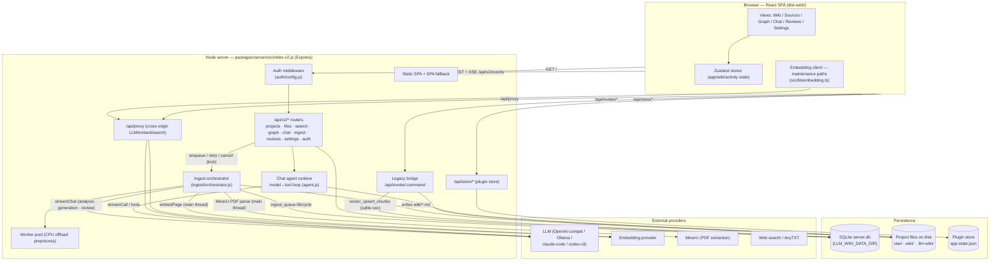

# LLM Wiki — Actual Architecture After PR #1 (As-Built)

> **Note:** This documents the **actual architecture status after PR #1** — the
> system as it was really built and merged, including where it diverges from the
> original design. The chartered V1 design it was built against is
> [V1_CHARTERED_ARCHITECTURE.md](../V1_CHARTERED_ARCHITECTURE.md); the open gaps
> between the two are tracked in issue #14.

High-level architecture of the web deployment, what lives in the database vs on
disk, and end-to-end dataflows for the two core operations: **ingest** (raw
document → wiki pages + embeddings) and **Q&A / chat** (question → grounded
answer).

> Scope: the **web client + Node server** stack (`packages/server` + the React
> SPA in `src/`, built to `dist-web/`). The desktop (Tauri) app shares the same
> on-disk project format and plugin store; differences are noted where relevant.

> Machine-readable counterpart: a LikeC4 model covering **both** the web and
> desktop stacks, with per-element evidence and rendered views, lives in
> [`docs/architecture/likec4/`](architecture/likec4/) — guide and evidence
> record in [`architecture/README.md`](architecture/README.md).

---

## 1. High-level architecture

Three runtime tiers plus external providers:



### Tier responsibilities

| Tier | What it does | Key files |
|---|---|---|
| **Browser SPA** | UI; holds app state; enqueues ingest sources and mirrors the server queue (`server-ingest-store.ts`); renders streaming chat/ingest events from SSE. | `src/` (views, `src/stores/server-ingest-store.ts`, `src/lib/sse-sync.ts`) |
| **Node server** | Serves the SPA; exposes the API; runs the **ingest pipeline** (`ingest/orchestrator.js` + `ingest/pipeline.js`) and the **chat agent loop** server-side; auth; SQLite access; CPU-offload worker pool; cross-origin proxy. | `packages/server/src/index-v2.js`, `api/*`, `ingest/*`, `agent.js`, `store/db.js`, `workers/` |
| **Persistence** | SQLite (relational metadata + embedding vectors via sqlite-vec), project files on disk (actual content), plugin store (config). | see §2 |
| **External** | LLM, embedding model, MinerU PDF extraction, web/AnyTXT search. | configured in plugin store / env |

**Important division of labor:** all heavy LLM work now runs **server-side** —
*ingest* in the orchestrator/pipeline (`ingest/llm.js`), *chat* in the agent
runtime (`agent.js`) (issue #14 P0; the browser pipeline was deleted). The
server worker pool offloads binary parsing (the `preprocess` task) to a worker
thread; everything else in the pipeline — MinerU parsing, image extraction,
embedding fetch, graph builds — runs on the main thread. The browser no longer
calls LLM providers for ingest; it only enqueues sources, watches SSE, and
performs a few maintenance flows (dedup/re-index) through the legacy bridge.

---

## 2. What is stored where

### 2a. SQLite — `server.db` (under `LLM_WIKI_DATA_DIR`, `/data` in Docker)

Relational **metadata**. Live schema (15 migrations applied):

| Table | Purpose | Status |
|---|---|---|
| `projects` | Registered projects (uuid, name, path, owner) | used |
| `users` | Local user accounts (username, password_hash) | used |
| `settings` | Per-user key/value settings | used |
| `ingest_queue` | Ingest task queue consumed by the server orchestrator (`pending → processing → completed/failed`; attempt_count, error, not_before for retry/usage-limit deferral) | used |
| `reviews` | Review items (type, title, status) | **dropped by migration `015`** — reviews are file-backed (`.llm-wiki/review.json`; see §7, G13 closing note) |
| `chat_sessions` | Chat session metadata (uuid, project_id, title, timestamps) | used |
| `chat_messages` | Chat message history (role, content, references JSON) | used |
| `graph_nodes` / `graph_edges` | Knowledge-graph cache (path, title, type, link_count; weighted edges) | **dropped by migration `015`** (never written — the graph is rebuilt on demand from `wiki/*.md`; see §7, G13 closing note) |
| `vec_chunks` | Embedding chunks — sqlite-vec **vec0 virtual table** (`chunk_id` PK, `project_id`/`page_id`/`chunk_index`/`chunk_text`/`heading_path`, `embedding FLOAT[dim]`, cosine distance) | used when the sqlite-vec extension loads (see note) |
| `vec_meta` | Current vector-index dimensionality (single row, `id = 1`) | used to drop/recreate `vec_chunks` when the embedding dimension changes |
| `_migrations` | Applied migration bookkeeping | used |

> **Note on `vec_chunks`:** embeddings are stored **in SQLite** via the
> [sqlite-vec](https://github.com/asg017/sqlite-vec) extension (issue #14).
> Migration `012` drops the old placeholder table and creates `vec_meta`; the
> vec0 virtual table itself is created **lazily** by `ensureVecTable` on the
> first embedding write, dimensioned by the embedding provider — on a freshly
> migrated server `vec_chunks` does not exist until the first embed. The
> extension is loaded best-effort in `getDb()`; if it fails to load
> (unsupported platform, extension missing), the server **degrades to
> keyword-only retrieval** and search responses carry a
> `vectorUnavailableReason` — requests never fail. The legacy per-project
> `.llm-wiki/vectorstore.json` is no longer written or read; upgrading a project
> means re-running "Re-index all pages" (or a fresh ingest). Dimension changes
> (different embedding model) drop and recreate the table via `vec_meta`.

> **Note on `chat_*`:** the web server keeps a SQLite record of every completed
> turn (issue #21), but model CONTEXT comes from the SHARED cross-client
> record — the client-held `conversations.json` history round-trip on both
> builds, hydrating from `.llm-wiki/agent-sessions/<sessionId>.json` (the
> desktop's `AgentSession` serde shape) only when a caller (e.g. `/api/v1/chat`)
> sends no explicit history. The shared session files are written by both the
> desktop and the web server in the identical on-disk format, so a chat started
> on one client resumes with the same context on the other. SQLite remains the
> web-only bookkeeping + link source for legacy sessions.

### 2b. Project files on disk — `<project>/`

The actual knowledge-base content:

```
<project>/
├── raw/sources/            # uploaded source documents (+ .cache/ for MinerU)
├── wiki/                   # generated markdown pages (the knowledge base)
│   ├── *.md                # concept / query / source-summary pages
│   ├── media/<slug>/       # images extracted from sources
│   ├── index.md            # deterministic wiki index
│   └── log.md              # append-only ingest log
└── .llm-wiki/              # per-project app state
    ├── vectorstore.json    # legacy embeddings (pre-sqlite-vec; no longer written or read — re-index to migrate)
    ├── ingest-cache.json   # skip-unchanged-source cache
    ├── image-caption-cache.json
    └── history/<hash>.json # file-history snapshots (human + agent edits)
```

### 2c. Plugin store — `app-state.json`

Configuration shared with the desktop app when co-located (resolved by
`store.js`; overridable via `LLM_WIKI_STORE_FILE` / `LLM_WIKI_NO_SHARE`):
LLM provider config, embedding config, the **global retrieval mode**
(`wikiSearchMode` — `keyword` / `vector` / `hybrid`, enforced server-side on
every search; the desktop Rust backend ignores this key), search/AnyTXT config,
the API auth token
(`apiConfig.token`), and the project registry (`projectRegistry` — maps project
id → path, used by the chat agent to locate a project on disk).

---

## 3. Dataflow — Ingest (raw document → wiki pages + embeddings)

Triggered by dropping/uploading a source (or enqueueing an existing file). The
**server drives the entire LLM pipeline** (issue #14 P0): the browser only
uploads/enqueues and watches progress over SSE; the orchestrator claims tasks
from SQLite and runs the pipeline end to end.

```mermaid
sequenceDiagram
  autonumber
  participant U as User
  participant SPA as Browser SPA
  participant SRV as Node server (api/ingest.js)
  participant ORC as Orchestrator (ingest/orchestrator.js)
  participant FS as Project disk
  participant DB as SQLite (server.db)
  participant LLM as LLM provider
  participant EMB as Embedding provider

  U->>SPA: drop / upload source
  SPA->>SRV: POST /ingest/upload (multipart) or POST /ingest {filePath}
  SRV->>FS: write raw/sources/<ts>_<hex8>_<name> (upload path)
  SRV->>DB: INSERT ingest_queue (pending, attempt_count 0)
  SRV-->>SPA: 201 {taskId} + SSE ingest:queued
  SRV->>ORC: kick()

  loop claim loop (concurrency LLM_WIKI_INGEST_CONCURRENCY, default 2;<br/>FIFO, one task per project at a time)
    ORC->>DB: claim next pending task (attempt_count += 1)
    ORC->>ORC: runIngestPipeline(task, env)
    ORC-->>SPA: SSE ingest:progress {stage, detail}
  end

  Note over ORC,FS: pipeline stages (ingest/pipeline.js)
  ORC->>FS: read source (MinerU for PDF → .cache/<name>.txt, else preprocess worker)
  ORC->>FS: check ingest cache — unchanged source → skip all LLM spend
  ORC->>FS: extract images → wiki/media/<slug>/ (optional VLM captions before injection)

  rect rgb(238,242,255)
  Note over ORC,LLM: LLM stages (server-side streamChat, ingest/llm.js)
  ORC->>LLM: analysis prompt (long sources: chunked with checkpoints)
  LLM-->>ORC: structured analysis
  ORC->>LLM: generation prompt (emits ---FILE: wiki/…--- blocks)
  LLM-->>ORC: page blocks (+ optional review stage + truncation repair)
  end

  ORC->>FS: write wiki/*.md (merge if page exists), update index.md + log.md
  ORC->>DB: persist reviews, save ingest cache (only when fully clean)

  rect rgb(240,255,240)
  Note over ORC,EMB: Embeddings (per written page, inline on the server main thread)
  ORC->>EMB: embeddings request (chunked markdown)
  EMB-->>ORC: vectors
  ORC->>DB: INSERT vec_chunks (sqlite-vec vec0, cosine)
  end

  ORC->>DB: UPDATE ingest_queue (completed)
  ORC-->>SPA: SSE ingest:complete {taskId, pagesCreated}
```

### Stages (server: `ingest/pipeline.js` → `runIngestPipeline`)

1. **Upload + enqueue** — `api/ingest.js`: multipart upload writes to
   `raw/sources/` with a collision-safe `<ts>_<hex8>_<name>` filename; the
   enqueue-by-path route re-ingests existing files (deduped against live
   tasks). Both insert `ingest_queue`, emit `ingest:queued`, and kick the
   orchestrator. The upload cap is env-configurable (`LLM_WIKI_MAX_UPLOAD_MB`,
   default 50MB; oversize answers `413 FILE_TOO_LARGE`). Files >10MB arrive
   through the chunked-upload protocol (§5) and join this stage when the client
   enqueues the completed file via the same enqueue-by-path route.
2. **Claim loop** — `ingest/orchestrator.js`: concurrency cap
   (`LLM_WIKI_INGEST_CONCURRENCY`, default 2, clamp 1–16), FIFO with
   per-project serialization, boot recovery (`resetInterruptedTasks`) and a
   60s sweep timer.
3. **Extract/preprocess** — MinerU for PDFs (`ingest/mineru.js`, cached to
   `raw/sources/.cache/`); otherwise the preprocess worker (text extraction
   with `.cache/<name>.txt` sibling caching).
4. **Cache check before any LLM spend** — `ingest/cache.js` skips unchanged
   sources (the image cascade still runs on cache hits).
5. **Images + captions** — `ingest/images.js` / `image-caption.js`: extract to
   `wiki/media/<slug>/`, optional VLM captioning before injection.
6. **LLM analysis → generation → review** — `ingest/llm.js` `streamChat` with
   the prompt builders in `ingest/prompts.js`; long sources are chunked with
   resumable checkpoints (`ingest/long-source.js`); truncated FILE blocks get
   a repair pass.
7. **Write wiki pages** — `ingest/write.js` `writeFileBlocks` (path-guarded,
   sanitized); existing pages merged via LLM; `index.md`/`log.md` updated
   deterministically; reviews folded into `.llm-wiki/review.json`
   (`ingest/reviews.js`).
8. **Embeddings** — `ingest/embed.js` `embedPage` per written page, run
   **inline on the pipeline's main thread** (plain embedding fetch followed by
   the `vec_chunks` SQLite upsert; there is no embed worker) → `vec_chunks`
   (sqlite-vec vec0 in SQLite).

### Queue semantics

- **Retry cap:** 3 attempts (`attempt_count`); a failed task becomes terminal
  `failed` and can be re-armed via `POST /queue/:taskId/retry`.
- **Usage limits never consume an attempt:** `deferIngestTaskForUsageLimit`
  rolls `attempt_count` back and parks the task on `not_before` (15 min).
- **LLM not configured:** terminal failure with the exact settings hint.
- **Cancel:** `DELETE /queue/:taskId` deletes the row, aborts the run, cleans
  up written files (structural `index.md`/`log.md`/`overview.md` are never
  deleted) and removes the pages' embeddings.
- **Progress:** every stage emits `ingest:progress` SSE frames with
  `{projectId, taskId, stage, detail}`; the client filters by project.
- **File/graph events around the run** (issue #14 SSE taxonomy): the upload
  route emits `file:created` for the raw source it just wrote. A successful
  run emits ONE aggregate `graph:updated` — `{projectId, nodesChanged,
  edgesChanged: 0}`, edges unknown because the orchestrator only tracks
  written paths — right after `ingest:complete`. Cancel cleanup emits
  `file:deleted` per actually-unlinked page (structural pages skipped, as
  above) plus one aggregate `graph:updated` when anything was removed.
  Per-page `file:*` events are **deliberately not emitted during the
  pipeline run**: `ingest:complete` (which carries `pagesCreated` and
  already refreshes the client tree) plus the aggregate subsume them, so one
  ingest costs one tree refresh instead of N.

**Artifacts:** disk (`raw/sources/`, `wiki/*.md`, `wiki/media/`,
`.llm-wiki/` caches) and SQLite (`ingest_queue`, `vec_chunks`).

---

## 4. Dataflow — Q&A / Chat (question → grounded answer)

Chat runs a **server-side agentic model↔tool loop**. Retrieval is **hybrid** by
default: keyword scoring + vector cosine search, fused with
reciprocal-rank-fusion (RRF). The retrieval mode is configurable
(`wikiSearchMode`: `keyword` / `vector` / `hybrid`) and resolved **server-side**
so it applies to the search UI, the chat agent, and the v1/v2 API alike.

```mermaid
sequenceDiagram
  autonumber
  participant U as User
  participant SPA as Browser SPA (chat-panel)
  participant SRV as Node server
  participant AG as Agent loop (agent.js)
  participant LLM as LLM provider
  participant VS as vec_chunks (SQLite) + wiki/

  U->>SPA: ask a question
  SPA->>SRV: start turn {message, sessionId?, mode?, tools?, resume?, regenerate?, historyLimit?}
  Note over SPA,SRV: shipped web client: invoke("agent_start_turn_stream") → legacy<br/>bridge POST /api/invoke/* — REST equivalent: POST /api/v2/projects/:id/chat
  SRV->>AG: agentStartTurnStream → runId (returned immediately; both entry points converge here)
  SRV-->>SPA: {runId, sessionId}  (answer streams over SSE agent-event)

  AG->>AG: resolve project path (plugin store projectRegistry) + LLM config
  AG->>AG: ensure session row, load prior messages from SQLite, persist user message
  AG->>AG: build messages (system prompt + DB history + question), pick tools

  loop model↔tool loop (max 8 iterations)
    AG->>LLM: streamCall(messages, tools)
    LLM-->>AG: text delta and/or tool_calls
    AG-->>SPA: SSE messageDelta (streams to UI)
    alt tool_call: wiki.search
      AG->>VS: search_project = keyword score + vector_search_chunks (cosine)
      VS-->>AG: ranked pages (RRF blend) + snippets
      AG-->>SPA: SSE referenceAdded
    else tool_call: wiki.read_page / source.search / graph.search / web.search
      AG->>VS: read page / scan raw sources / graph / web
      VS-->>AG: observation + references
    end
    AG->>AG: append tool observation to messages
  end

  AG->>AG: append assistant message (+references) to chat_messages
  AG-->>SPA: SSE done {finalText, references}
  SPA->>U: render grounded answer + cited pages/sources
```

### How it works

1. **Request** — two entry points converge on `agentStartTurnStream`
   (`agent.js`): the shipped web client starts and cancels turns through the
   legacy bridge (`invoke("agent_start_turn_stream")` /
   `invoke("agent_cancel_turn")` → the `agent.js` command registry), and
   `api/chat.js` is the REST equivalent (`POST /api/v2/projects/:id/chat`),
   validating the body — `{message, sessionId?, mode?, tools?, topK?,
   includeContent?, skills?, resume?, regenerate?, historyLimit?}` — against
   the api-types schema. Either way the `runId` returns immediately (echoing
   the client's `sessionId`, or a server-generated one) and the turn runs
   asynchronously, streaming `agent-event` payloads over SSE. Since the SSE
   taxonomy (issue #14), the same choke points additionally dual-emit the
   chartered `chat:*` frames (`chat:delta` / `chat:toolStart` /
   `chat:toolEnd` / `chat:done`) so a tab that did not start the run can
   sync it too; `agent-event` stays byte-identical (see §5).
2. **Agent loop** (`agent.js` → `runLoop`, max 8 iterations) — builds the
   message list (system prompt + **server-loaded history** + the question),
   selects tools (`wiki.search`, `wiki.read_page`, `source.search`,
   `graph.search`; plus `web.search`/`anytxt.search` if enabled), and loops:
   call the LLM → if it returns tool calls, execute them and feed observations
   back → until the model answers with no further tool calls.
3. **Retrieval** — the `wiki.search` tool calls `search_project`
   (`commands/search.js`). The **retrieval mode** is resolved server-side:
   explicit request param → plugin store `wikiSearchMode` → default `hybrid`.
   - **keyword** scoring (title/body token matches + graph expansion), and
   - **vector** search — `vector_search_chunks` over the sqlite-vec `vec_chunks`
     vec0 table (`MATCH embedding` + `project_id` filter, cosine distance),
   - combined with **reciprocal-rank-fusion** into one ranked list.
   When the vector leg cannot run (extension not loaded, no embedding provider,
   embedding request failed, or the project's index is empty / dimension-
   mismatched after a provider switch), search **degrades to keyword results**
   and the response carries `vectorUnavailableReason` — the request itself never
   fails. In `vector` mode a failed vector leg also falls back to keyword (with
   the reason) rather than returning nothing.
4. **References** — every tool result contributes references (wiki pages,
   sources, graph nodes, web results); they are deduped and attached to the
   final answer, which the UI renders as citations.
5. **Deep mode** — brackets the retrieval phase with `deep_research.run`
   start/end events; does not force web search on (still gated by `tools.web`).
6. **Shell tools** — `shell.exec` is gated behind an active skill + per-command
   approval policy (or `LLM_WIKI_ALLOW_SHELL=1`).

**Persistence:** the web server keeps its own SQLite record (issue #21) —
the session row is ensured on the first turn of a conversation
(client-generated session UUID, unique-indexed), the user message is
persisted at turn start and the assistant message (with its references JSON)
at turn completion (never per streamed delta, so a cancelled or errored turn
leaves just the user message). Since the "one backend, one user data" goal,
MODEL CONTEXT is sourced from the SHARED cross-client record instead,
mirroring the desktop runtime:
- an explicit client history (`historyExplicit: true`, the React app's
  `conversations.json` round-trip on both builds) wins verbatim — continuing
  a conversation created on the other client keeps its full context;
- otherwise the last 12 messages hydrate from the shared on-disk session
  store (`.llm-wiki/agent-sessions/<sessionId>.json`, the desktop's
  `AgentSession` serde shape — see `agent-sessions.js`), and `chat_messages`
  is the fallback for legacy web-only sessions, capped at `historyLimit`
  (client setting, default 10; server default 20);
- on successful completion the exchange also appends to that shared session
  file when `persistSession !== false` (the desktop's default true), so
  `/api/v1/chat` (MCP / external agent skill) and streaming UI turns resume
  on either client (`agent_get_session` / `agent_list_sessions` read the same
  files, desktop arg names and shapes).
A `regenerate: true` re-run drops the last user/assistant exchange from both
stores first, so the re-persisted pair replaces the old one. The `:id`
segment accepts either the integer projects-table id or the project UUID; the
UUID path resolves via the plugin-store registry and materializes the
projects row (`chat_sessions`' FK target) on demand. A `resume: true`
re-send (approval/continuation scaffolding) skips persisting the user
message. Session CRUD: list/create/get/rename/delete under
`/projects/:id/chat/sessions`, with cross-project access returning 404.

---

## 5. Key architectural notes

- **All LLM work is server-side** (issue #14 P0). Ingest LLM calls run in the
  orchestrator/pipeline (`ingest/llm.js` `streamChat`); chat LLM calls run in
  the agent runtime (`agent.js`). Both target the same configured providers
  resolved from the shared plugin store. The browser pipeline
  (`src/lib/ingest.ts`) was deleted; `/api/proxy` still serves desktop-era
  maintenance flows and cross-origin calls.
- **Vectors live in SQLite via sqlite-vec** (web, issue #14). `vec_chunks` is a
  sqlite-vec vec0 virtual table (created lazily on the first embedding write —
  the sqlite-vec extension itself is loaded best-effort in `getDb()`); if the
  extension cannot load the server keeps working with keyword-only retrieval
  and answers carry `vectorUnavailableReason`. The legacy
  `.llm-wiki/vectorstore.json` file store is no longer used.
- **Retrieval mode is a server-enforced setting.** `wikiSearchMode`
  (`keyword` / `vector` / `hybrid`, default `hybrid`) is stored in the shared
  plugin store and resolved server-side on every search, so the search UI, the
  chat agent, and the v1/v2 endpoints all honor it without client-side wiring.
  Settings → Embeddings exposes the selector.
- **Chat context is shared cross-client.** Model context follows the desktop
  contract: explicit client-held history (`conversations.json` round-trip on
  both builds) wins; history-less callers hydrate from the shared
  `.llm-wiki/agent-sessions/<sessionId>.json` files (desktop `AgentSession`
  shape, `agent-sessions.js`); successful turns append there when
  `persistSession !== false`. SQLite (`chat_sessions`/`chat_messages`,
  issue #21) remains the web server's own record and the fallback for legacy
  web-only sessions.
- **Single-process server.** `index-v2.js` serves the SPA, the v2 REST API, and
  the legacy `/api/invoke/*` bridge in one process — no second service needed.
- **SSE event taxonomy is emitted end-to-end** (issue #14, charter §4.7). The
  full chartered taxonomy — `file:created/modified/deleted`, `graph:updated`,
  `settings:changed`, `chat:delta/toolStart/toolEnd/done` — is now published
  at the mutation sites alongside the pre-existing `ingest:*` frames, so
  multiple tabs/devices stay in sync without polling. All frames ride the
  legacy `emit()` bridge (`events.js`), which republishes onto the internal
  bus with envelope `projectId: null` — attribution rides in the payload,
  exactly like `ingest:*` — and reach both `GET /api/events` and
  `GET /api/v2/events`:
  - `file:*` at every API-mediated write path: files upload (a pre-write
    existence check decides created vs modified), ingest upload,
    chunked-upload completion (same existence check), maintenance
    rebuild-index and file-history restore, cancel cleanup (`file:deleted`
    per unlinked page), chat Write-to-Wiki FILE blocks plus the post-write
    image injection (created vs modified by the same existence check), and
    the legacy invoke filesystem writers (no project context there —
    resolved by longest-prefix match against `projects.path`, null when
    unresolved). One exception: the chat **agent's** tool writes
    (`wiki.write_page` / `workspace.write_file` / `workspace.append_file`)
    write files directly and emit only an `agent-event` `fileChanged` frame
    (consumed by the active tab alone) — no `file:*`, no `graph:updated` —
    so other tabs are not invalidated when the agent edits a page. Ingest
    runs deliberately emit no per-page events (§3).
  - `graph:updated` as ONE aggregate per mutation ("wiki pages changed ⇒
    graph caches stale"; payload `{projectId, nodesChanged, edgesChanged}`)
    after ingest success/cancel, rebuild-index, and chat writes completion
    (agent tool writes emit none — see the `file:*` bullet).
  - `settings:changed` (`{keys}`, host-global) on every `/api/v2/settings`
    write and on writes to the shared store (`app-state.json`) through the
    `/api/store` shim and the legacy server; other store names emit nothing.
  - `chat:*` dual-emitted next to the byte-identical `agent-event` frames
    (§4) so tabs that did not start a run can still sync it. Failed and
    cancelled runs dual a TERMINAL `chat:done` (`Error: <message>` on
    failure, empty content on cancel) so previewing tabs always leave
    streaming state — a non-owning tab has no `agent-event` consumer to
    reset it otherwise.
  The client sync layer (`src/lib/sse-sync.ts`) dispatches each frame to the
  store that owns the state: `file:*` refreshes the project file tree
  (trailing-debounced ~400 ms — one chat save emits several frames),
  `graph:updated` bumps the graph `dataVersion`, `settings:changed`
  refetches settings, and `chat:*` applies only to conversations present in
  the chat store and skips runs the local tab owns (the chat-panel
  tombstones its run ids in the store — the active tab already renders them
  from `agent-event`, so applying them twice would double tokens). Accepted
  degradations: the server file watcher (`commands/fileSync.js`) is not
  auto-started by `index-v2.js` at boot — it runs when the client requests it
  (`start_project_file_watcher`, default-enabled in the web build) and pushes
  out-of-band edits over the legacy `file-sync://` / `project://files-changed`
  frames, and anything a disconnected client missed is covered by the
  reconnect full-refresh; the incremental graph tables
  (`graph_nodes`/`graph_edges`) were dropped by migration `015` (issue #39 —
  never written), so `edgesChanged` is best-effort and the graph is still
  rebuilt on demand from `wiki/*.md`; the
  charter-shaped `events/sse.js` SSEManager remains dead code (never
  mounted; removal is churn with no user value); cross-tab chat sync shows
  live tokens but not tool-step UI (`agent-event` only, active tab).
- **Auth** (`auth/config.js`): `LLM_WIKI_AUTH_MODE` is the chartered primary
  (`none` → open, `token` → required, `open` normalized to `none`; the
  docker-compose default), `AUTH_MODE` a deprecated warn-once alias — the
  primary wins when both are set; unset (**auto**) → open when no token is
  configured, required once a token is set (env `LLM_WIKI_API_TOKEN` or
  plugin-store `apiConfig.token`).
- **Chunked upload for large files** (issue #14, charter §4.8). Files >10MB
  take the three-step protocol under `/api/v2/projects/:id/files/upload/…`:
  `POST …/upload/init {fileName, fileSize, destPath}` → `201 {uploadId}`,
  `PUT …/upload/:uploadId/chunk?offset=N` (octet-stream) → `{received}`,
  `POST …/upload/:uploadId/complete` → `{path, size}` — the charter shapes
  verbatim; files ≤10MB stay on the single-shot multipart `POST /ingest/upload`.
  The client sends 5MB chunks with per-chunk retry and offset-resume: an offset
  that does not equal the server's byte count answers 400 `VALIDATION_ERROR`
  with `details.received`, and the client resumes from that count. Sessions
  live in an in-memory Map (`uploads/chunked.js`; a server restart drops them —
  accepted degradation, the client re-uploads) with a 24h idle TTL swept by a
  timer started from the index-v2 boot block, and chunk bytes accumulate in
  staging files under `LLM_WIKI_DATA_DIR/upload-staging/` so half-written data
  never appears in the project tree. Completion resolves `destPath` via
  `safeJoin`, lands the file through the repo's same-dir tmp+rename
  atomic-write convention, and emits `file:created`/`file:modified` (added to
  the SSE `file:*` write-site list above). `complete` does NOT auto-enqueue — the response carries `{path, size}`
  with no taskId, and the client enqueues via `POST /ingest` (enqueue-by-path).
  The overall upload cap is `LLM_WIKI_MAX_UPLOAD_MB` (default 50MB, previously
  a hardcoded literal): init answers `413 FILE_TOO_LARGE` on an oversize
  `fileSize`, and the multipart route's multer oversize error now maps to the
  same `413 FILE_TOO_LARGE` instead of the scrubbed 500 it fell through to.
- **API contract is a single source of truth** (`packages/api-types`, issue #20).
  The Zod schemas in `packages/api-types/src/schemas/` define the wire format
  once: the server (plain JS) imports the **built** schemas to validate requests,
  and the web client consumes the same package's `z.infer` types and error codes
  (`ERROR_CODES` — the server's `ErrorCode` is derived from them, no hand-mirror).
  One schema source, two consumers, so server validation and client types cannot
  drift. The OpenAPI document (`/api/v2/openapi.json`) is generated from these
  same schemas for a **documented subset** of routes (projects CRUD, chat
  sessions, chunked upload — see G20); unregistered endpoints are indexed in
  [API_REFERENCE.md](./API_REFERENCE.md). CI and Docker build
  `@llm-wiki/api-types` before the server and the web client.
- **Shared state with desktop.** When the server runs on the same host as the
  desktop app, it reads/writes the desktop's plugin store so settings stay in
  sync; disable with `LLM_WIKI_NO_SHARE=1`.

---

## 6. Quick reference — endpoints used above

| Flow | Endpoint | Handler |
|---|---|---|
| Ingest upload | `POST /api/v2/projects/:id/ingest/upload` | `api/ingest.js` |
| Chunked upload init | `POST /api/v2/projects/:id/files/upload/init` | `api/files.js` → `uploads/chunked.js` |
| Chunked upload chunk | `PUT /api/v2/projects/:id/files/upload/:uploadId/chunk` | `api/files.js` → `uploads/chunked.js` |
| Chunked upload complete | `POST /api/v2/projects/:id/files/upload/:uploadId/complete` | `api/files.js` → `uploads/chunked.js` |
| Ingest enqueue (existing file) | `POST /api/v2/projects/:id/ingest` | `api/ingest.js` |
| Ingest queue | `GET /…/ingest/queue`, `POST /…/queue/clear`, `GET /…/queue/:taskId`, `POST /…/queue/:taskId/retry`, `DELETE /…/queue/:taskId` | `api/ingest.js` → `store/ingest-queue.js` + `ingest/orchestrator.js` |
| Chat turn | REST: `POST /api/v2/projects/:id/chat`; the shipped web client uses the legacy bridge `POST /api/invoke/agent_start_turn_stream` | `api/chat.js` / `agent.js` command registry → `agentStartTurnStream` |
| Chat Write-to-Wiki | `POST /api/v2/projects/:id/chat/writes` | `api/chat.js` (streams `agent-event` frames) |
| Chat cancel | REST: `POST /api/v2/projects/:id/chat/:runId/cancel`; the web client uses `POST /api/invoke/agent_cancel_turn` | `api/chat.js` / `agent.js` |
| Chat sessions | `GET/POST /api/v2/projects/:id/chat/sessions`, `GET/PATCH/DELETE …/:sessionId` | `api/chat.js` → `store/chat-sessions.js` |
| Search | `POST /api/invoke/search_project` (via bridge) | `commands/search.js` |
| Embeddings | `POST /api/proxy` + `embedding_fetch` / `vector_upsert_chunks` | `proxy.js`, `commands/search.js`, `commands/vectorstore.js` |
| Events (SSE) | `GET /api/v2/events` | `api/events.js` |
| Health | `GET /api/v2/health` | `index-v2.js` |

---

## 7. Accepted deviations

Consciously accepted deviations from the chartered design, consolidated under
issue #14's closure bar: *implement the gaps with real user value; formally
accept and document the rest.* The charter stays pristine as the promise; this
section is the ledger.

### Per-feature degradations

| Deviation | Why accepted | Where documented |
|---|---|---|
| **G1** Chunked-upload sessions are in-memory only: a server restart drops them, orphaned staging files are wiped at boot, and the client re-uploads from byte 0 | v1 single-user — a persistence table buys nothing a re-upload doesn't | plans/chunked-upload.md (PR #30); §5 chunked-upload note |
| **G2** No abort/cancel endpoint for chunked uploads — an abandoned upload leaves its session to the 24h idle-TTL sweep | The charter defines no cancel route; the TTL sweep is sufficient for single-user | plans/chunked-upload.md (PR #30) |
| **G3** Chunk PUT bodies are buffered per-chunk in process memory (client sends 5MB chunks; the server rejects anything overflowing the declared file size) before appending to staging | Bounded by the chunk size; streaming the last hop adds complexity with no v1 payoff | plans/chunked-upload.md (PR #30) |
| **G4** No `vectorstore.json` → sqlite-vec migration — upgrading a project means re-running "Re-index all pages" or a fresh ingest | Zero real data existed at cutover; code simplicity wins | issue #14 sqlite-vec decision (PR #27); §2a + §5 |
| **G5** Vector leg unavailable (extension not loaded / no provider / request failed / dimension mismatch) → search degrades to keyword results with `vectorUnavailableReason`; requests never fail | Retrieval must stay available — degraded over broken | issue #14 sqlite-vec decision (PR #27); §2a, §4 |
| **G6** Ingest retry cap: 3 attempts, then terminal `failed` (surfaced in UI; manual retry re-arms) | Bounded retry spend; failures are visible and re-armable | plans/server-ingest.md + issue #14 P0 decision (PR #28); §3 queue semantics |
| **G7** A server restart drops in-flight chat turns — runs live in an in-memory map with no crash recovery; the user message persists (written at turn start), the assistant reply is lost; completed turns are safe | Completed turns are persisted in SQLite; re-asking a question is cheap, unlike re-running a multi-stage ingest | issue #14 P0 scoped crash recovery to `ingest_queue` only (`agent.js` runs map); §3/§4 |
| **G8** Desktop standalone ingest requires a reachable server (`127.0.0.1:19828`); sidecar packaging is out of scope | v1 is web-first; the desktop thin shell is v2 (Decision 6) | plans/server-ingest.md (PR #28) |
| **G9** claude-code / codex-cli providers cannot ingest server-side — the orchestrator fails fast at claim ("requires the desktop CLI") | CLI providers need the desktop runtime; there is no server-side equivalent | plans/server-ingest.md (PR #28); `ingest/orchestrator.js` |
| **G10** Server-side image extraction is JS (pdfjs-dist + pure-JS PNG) and may differ from the desktop's Rust pdfium on exotic PDF rasters | Portability of the server pipeline over exact parity with desktop | plans/server-ingest.md (PR #28) |
| **G11** MinerU local backend requires co-location; an unreachable or failing MinerU falls back to the built-in pdfium preprocess | MinerU is an optional enhancement, never a hard dependency | plans/server-ingest.md (PR #28); `ingest/pipeline.js` |
| **G12** The server file watcher (`commands/fileSync.js`) is not auto-started at `index-v2.js` boot — it runs only when a client requests it (`start_project_file_watcher`, default-enabled in the web build); with no connected client, out-of-band edits rely on the reconnect full-refresh | Smart reconnect (charter §8) already covers it with a full refresh; server-side auto-start is churn without user value | plans/sse-taxonomy.md (PR #29); §5 SSE note |
| **G13** `graph_nodes`/`graph_edges` were never written; the graph is rebuilt on demand from `wiki/*.md`, and `graph:updated.edgesChanged` is best-effort (`0` when unknown) | The incremental graph index is a separate gap; on-demand rebuild is fast enough at v1 scale. **Closing note:** the schema-only tables (plus the file-less `reviews` table) were dropped by migration `015` (issue #39) — the file-backed stores are the single source of truth, so the drop removes the split-truth invite with zero data loss | plans/sse-taxonomy.md (PR #29); §2a + §5 SSE note; issue #39 |
| **G14** The charter-shaped `events/sse.js` SSEManager remains dead code (never mounted) | Removal is churn with no user value; the live transport is the `emit()` bridge | plans/sse-taxonomy.md (PR #29); §5 SSE note |
| **G15** Cross-tab chat sync shows live tokens only — tool-step UI renders in the active tab (`agent-event`) | Taxonomy fidelity on the wire without building a second tool-step renderer | plans/sse-taxonomy.md (PR #29); §5 SSE note |
| **G16** The client's `ownedRunIds` tombstones grow unbounded within a long-lived conversation (cleared only on conversation delete / project reset) | Tombstones must survive the done-frame race; the O(n) check is fine at v1 turn counts | plans/sse-taxonomy.md (PR #29) |
| **G17** `@llm-wiki/api-types` is a built workspace dependency of the plain-JS server — Docker/CI must build it before the server and client | Accepted cost of one schema source with zero drift | issue #14 api-types decision (PR #23); §5 |
| **G18** The SSE contract evolved from the charter shape — envelope `{type, projectId, payload}` on `/api/v1/events` became `{event, payload}` on `/api/v2/events` | The global-stream + taxonomy design is strictly more capable (`runId` demux); a client written from the charter was never shipped | docs/architecture/PROMISE_VS_ACTUAL_REVIEW_2026-08-05.md NF-3; §5 SSE note |
| **G19** Worker pool narrowed from the chartered three roles (parsing/embedding/graph-rebuild) to preprocess-only; embedding runs main-thread (network I/O), graph rebuild stays on-demand (G13). Image extraction is dispatched through the registered worker handler | Embedding is network-bound (a worker adds nothing) and the graph index is superseded by G13's closure; scope reduction recorded instead of left silent | PROMISE_VS_ACTUAL_REVIEW_2026-08-05.md NF-4; `workers/tasks.js`; §3 |
| **G20** "Auto OpenAPI, zero drift" is re-scoped to a **documented subset**: `/api/v2/openapi.json` registers projects CRUD, chat sessions, chunked upload, and errors only; search/ingest/invoke surfaces are not described | Honest claim beats aspirational coverage; API_REFERENCE.md already states the subset. Full typing of the remaining surfaces lands incrementally under the S2 rule below | PROMISE_VS_ACTUAL_REVIEW_2026-08-05.md NF-5; issue #38; §5 |
| **G21** Two server entries existed where one was chartered: `index-v2.js` (Docker CMD, `/api/v2`) plus the legacy raw-`node:http` `index.js`, sole mount of `/api/v1`. **Retired 2026-08-27 (issue #40):** the legacy entry and `/api/v1` (handleApiV1 in api-v1.js) were deleted after the MCP server and browser clipper migrated directly onto `/api/v2` (clip: `POST /api/v2/projects/:id/clip`; MCP: `POST /api/v2/projects/:id/chat/sync` + `POST /sources/rescan` + `GET /files?root=` etc., all with `@llm-wiki/api-types` schemas; no v1 shim). Docker and local `npm start` now run the sole `index-v2.js` entry. | MCP + clipper are now ordinary remote v2 clients (single origin, `LLM_WIKI_API_BASE_URL` may be `https://remote:3000`); long-term coexistence rejected per thin-client direction | PROMISE_VS_ACTUAL_REVIEW_2026-08-05.md NF-2/NF-7; owner session 2026-08-26; issue #40 |
| **G22** Chat streaming shape evolved from the charter sketch (POST returning the stream body) to POST → `{runId, sessionId}` with tokens streamed over the global SSE stream and messages persisted at turn boundaries | More consistent with Decision 13's single global event stream; works identically for every thin client and survives tab switches/reconnects | PROMISE_VS_ACTUAL_REVIEW_2026-08-05.md NF-8; PR #25; §4 |

### Owner direction — 2026-08-26 (thin-client architecture decisions)

Recorded from the owner's review session of
[PROMISE_VS_ACTUAL_REVIEW_2026-08-05.md](./architecture/PROMISE_VS_ACTUAL_REVIEW_2026-08-05.md):

1. **One backend, many thin clients.** The Node server (`packages/server`,
   `/api/v2`) is the single backend. The desktop app is just another client
   connecting to a (possibly remote) server; its Rust backend is retired via
   migration path — consumers move first (MCP server, browser clipper), then
   the shell.
2. **No filesystem exposure.** Clients never touch the server's filesystem
   directly; all access goes through the API.
3. **Client pipelines move server-side.** Deep research, dedup, lint, and
   image captioning currently drive LLM calls from the browser via
   `/api/proxy`; they become v2 endpoints so any client gets the same
   capability (sequenced after the MCP/clipper v2 migration).
 4. **SSOT rule (S2):** no surface migrates to v2 without an
    `@llm-wiki/api-types` schema. Migration PRs must include their Zod
    schemas, so each migrated surface joins the typed contract instead of
    growing untyped debt.

| **G23** Desktop-capability parity port: the server absorbs desktop-only features the charter never promised it — outbound proxy plumbing (`proxy-env.js`), clip-server listener (`clip-server.js`), AnyTXT search (`anytxt.js`), websearch, on-disk agent sessions, embedding fetch layer, raw file streaming, user-input bridge — plus `scripts/verify/` surface-parity checks | Not a charter deviation but an unledgered scope extension; recorded per owner thin-client direction (S1): for the desktop to become just another client, everything its Rust backend does must exist on the Node side first. The charter stays pristine as the promise | owner session 2026-08-26; PROMISE_VS_ACTUAL_REVIEW_2026-08-05.md S1/NF-2; issues #40/#41 |

### Structural deviations from the charter layout (issue #14 — ACCEPT, no code churn)

- Server is plain `.js`, not TypeScript (charter §3) — the churn tax outweighs
  the v1 payoff; the wire contract is typed via `@llm-wiki/api-types`.
- Business logic lives in `commands/` + top-level files, not a `core/`
  directory (charter §3).
- The web client is root `src/`, not `packages/web/` (charter §3).
- Projects live at user-chosen absolute paths, not under
  `/data/projects/<id>/` (charter §4.2).
- No `packages/desktop/` placeholder — the desktop thin shell is deferred to
  v2 (Decision 6).

Source for all five: issue #14 "P3 — Structural / cosmetic deviations —
accepted" decision (2026-08-03).

### V1 scope exclusions (charter Decision 1 + §12; reaffirmed by issue #14)

Self-hosted single-user only. Out of scope for v1: multi-user / shared
projects, hosted SaaS offering, mobile client, offline mode / service-worker
caching, WebSocket (SSE is sufficient), a dedicated vector DB (sqlite-vec
scales to 100K+), CRDT/OT collaborative editing (last-write-wins + file
history instead), and the desktop thin-shell rewrite (v2).

See [API_REFERENCE.md](./API_REFERENCE.md) for the full endpoint inventory and
[DEPLOYMENT.md](./DEPLOYMENT.md) for hosting.
