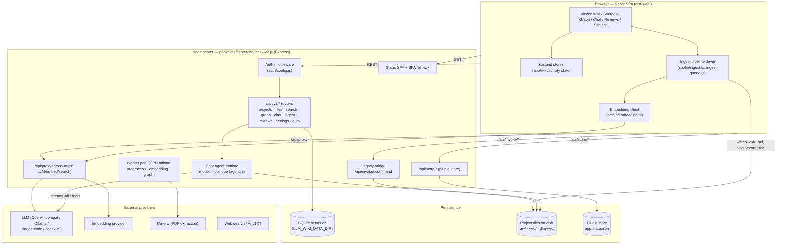
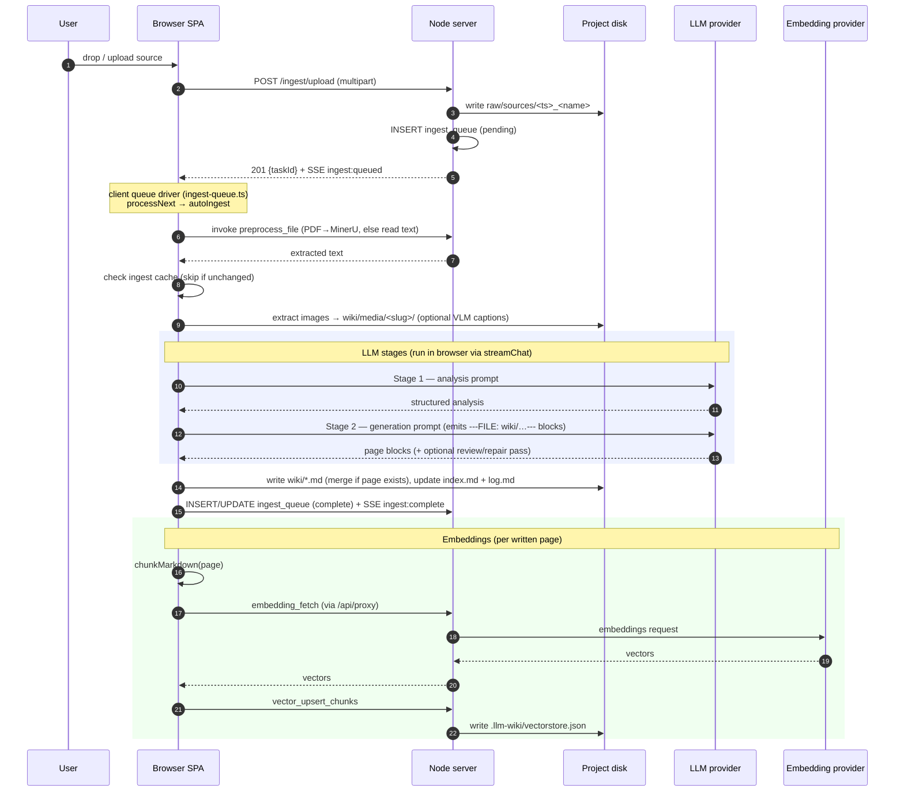
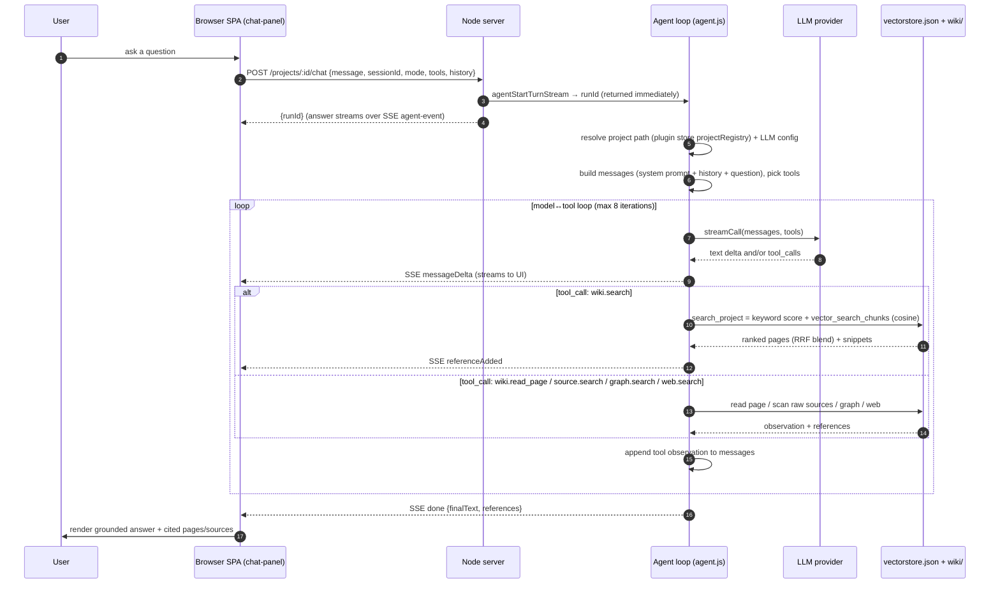

# LLM Wiki — Actual Architecture After PR #1 (As-Built)

> **Note:** This documents the **actual architecture status after PR #1** — the
> system as it was really built and merged, including where it diverges from the
> original design. The chartered V1 design it was built against is
> [V1_CHARTERED_ARCHITECTURE.md](../V1_CHARTERED_ARCHITECTURE.md); the open gaps
> between the two are tracked in issue #14.

High-level architecture of the web deployment, what lives in the database vs on
disk, and end-to-end dataflows for the two core operations: **ingest** (raw
document → wiki pages + embeddings) and **Q&A / chat** (question → grounded
answer).

> Scope: the **web client + Node server** stack (`packages/server` + the React
> SPA in `src/`, built to `dist-web/`). The desktop (Tauri) app shares the same
> on-disk project format and plugin store; differences are noted where relevant.

---

## 1. High-level architecture

Three runtime tiers plus external providers:



### Tier responsibilities

| Tier | What it does | Key files |
|---|---|---|
| **Browser SPA** | UI; holds app state; **drives the ingest LLM pipeline client-side**; renders streaming chat; computes embeddings via the proxy. | `src/` (views, `src/lib/ingest.ts`, `src/lib/embedding.ts`, `src/lib/llm-client.ts`) |
| **Node server** | Serves the SPA; exposes the API; runs the **chat agent loop server-side**; auth; SQLite access; CPU-offload worker pool; cross-origin proxy. | `packages/server/src/index-v2.js`, `api/*`, `agent.js`, `store/db.js`, `workers/` |
| **Persistence** | SQLite (relational metadata), project files on disk (actual content + vectors), plugin store (config). | see §2 |
| **External** | LLM, embedding model, MinerU PDF extraction, web/AnyTXT search. | configured in plugin store / env |

**Important division of labor:** the heavy LLM work for *ingest* runs in the
**browser** (the server worker pool only offloads CPU tasks — binary parsing,
embedding fetch, graph build). The LLM work for *chat* runs **server-side** in
the agent runtime. Both call the same external LLM providers.

---

## 2. What is stored where

### 2a. SQLite — `server.db` (under `LLM_WIKI_DATA_DIR`, `/data` in Docker)

Relational **metadata**. Live schema (9 migrations applied; all tables empty on
a fresh install):

| Table | Purpose | Status |
|---|---|---|
| `projects` | Registered projects (name, path, owner) | used |
| `users` | Local user accounts (username, password_hash) | used |
| `settings` | Per-user key/value settings | used |
| `ingest_queue` | Server-side ingest task queue (upload → pending/done) | used |
| `reviews` | Review items (type, title, status) | used |
| `chat_sessions` | Chat session metadata | **schema-only — no writer** |
| `chat_messages` | Chat message history | **schema-only — no writer** |
| `graph_nodes` / `graph_edges` | Knowledge-graph cache (path, title, type, link_count; weighted edges) | written when the graph is built |
| `vec_chunks` | Embedding chunks (chunk_text, heading_path, embedding BLOB) | **schema-only — no writer** (see note) |
| `_migrations` | Applied migration bookkeeping | used |

> **Note on `vec_chunks`:** the table exists for the desktop/LanceDB path, but on
> the **web server embeddings are NOT stored in SQLite**. They live as JSON in
> `<project>/.llm-wiki/vectorstore.json` (cosine-ranked). See §3/§4.

> **Note on `chat_*`:** chat history is **not persisted to SQLite**. It is held
> client-side (the client passes `history` in each chat request) and in an
> in-memory map on the server. Restarting the server does not lose your wiki, but
> chat transcripts are ephemeral.

### 2b. Project files on disk — `<project>/`

The actual knowledge-base content:

```
<project>/
├── raw/sources/            # uploaded source documents (+ .cache/ for MinerU)
├── wiki/                   # generated markdown pages (the knowledge base)
│   ├── *.md                # concept / query / source-summary pages
│   ├── media/<slug>/       # images extracted from sources
│   ├── index.md            # deterministic wiki index
│   └── log.md              # append-only ingest log
└── .llm-wiki/              # per-project app state
    ├── vectorstore.json    # ★ embeddings (chunk text + vectors), cosine search
    ├── ingest-queue.json   # client-side ingest queue
    ├── ingest-cache.json   # skip-unchanged-source cache
    ├── image-caption-cache.json
    └── history/<hash>.json # file-history snapshots (human + agent edits)
```

### 2c. Plugin store — `app-state.json`

Configuration shared with the desktop app when co-located (resolved by
`store.js`; overridable via `LLM_WIKI_STORE_FILE` / `LLM_WIKI_NO_SHARE`):
LLM provider config, embedding config, search/AnyTXT config, the API auth token
(`apiConfig.token`), and the project registry (`projectRegistry` — maps project
id → path, used by the chat agent to locate a project on disk).

---

## 3. Dataflow — Ingest (raw document → wiki pages + embeddings)

Triggered by dropping/uploading a source. The **browser drives the LLM
pipeline**; the server handles upload, queue bookkeeping, and CPU offload.



### Stages (client: `src/lib/ingest.ts` → `autoIngestImpl`)

1. **Upload + enqueue** (server) — `api/ingest.js`: write to `raw/sources/`,
   insert `ingest_queue`, emit `ingest:queued`.
2. **Extract/preprocess** — MinerU for PDFs (`mineru.ts`, cached to
   `raw/sources/.cache/`); otherwise `preprocess_file` (server `commands/preprocess.js`).
3. **Cache check** — `ingest-cache.ts` skips unchanged sources.
4. **Images** — extract to `wiki/media/<slug>/`; optional VLM captioning.
5. **LLM analysis** (Stage 1) — `streamChat` + `buildAnalysisPrompt`.
6. **LLM generation** (Stage 2) — `streamChat` + `buildGenerationPrompt`,
   emitting `---FILE: wiki/…---` blocks; optional review/repair passes.
7. **Write wiki pages** — `writeFileBlocks` (path-guarded, sanitized); existing
   pages merged via LLM (`page-merge.ts`); `index.md`/`log.md` updated
   deterministically.
8. **Embeddings** — `embedPage` per written page → chunk → `embedding_fetch` →
   `vector_upsert_chunks` → `vectorstore.json`.

**Artifacts:** disk (`raw/sources/`, `wiki/*.md`, `wiki/media/`,
`.llm-wiki/vectorstore.json` + caches) and SQLite (`ingest_queue`).

---

## 4. Dataflow — Q&A / Chat (question → grounded answer)

Chat runs a **server-side agentic model↔tool loop**. Retrieval is **hybrid**:
keyword scoring + vector cosine search, fused with reciprocal-rank-fusion (RRF).



### How it works

1. **Request** — `api/chat.js` validates the body and calls
   `agentStartTurnStream`; the `runId` returns immediately and the turn runs
   asynchronously, streaming `agent-event` payloads over SSE.
2. **Agent loop** (`agent.js` → `runLoop`, max 8 iterations) — builds the
   message list (system prompt + client-supplied `history` + the question),
   selects tools (`wiki.search`, `wiki.read_page`, `source.search`,
   `graph.search`; plus `web.search`/`anytxt.search` if enabled), and loops:
   call the LLM → if it returns tool calls, execute them and feed observations
   back → until the model answers with no further tool calls.
3. **Retrieval** — the `wiki.search` tool calls `search_project`
   (`commands/search.js`), which is **hybrid**:
   - **keyword** scoring (title/body token matches), and
   - **vector** search — `vector_search_chunks` over `.llm-wiki/vectorstore.json`
     (cosine similarity),
   - combined with **reciprocal-rank-fusion** into one ranked list.
4. **References** — every tool result contributes references (wiki pages,
   sources, graph nodes, web results); they are deduped and attached to the
   final answer, which the UI renders as citations.
5. **Deep mode** — brackets the retrieval phase with `deep_research.run`
   start/end events; does not force web search on (still gated by `tools.web`).
6. **Shell tools** — `shell.exec` is gated behind an active skill + per-command
   approval policy (or `LLM_WIKI_ALLOW_SHELL=1`).

**Persistence:** chat turns are **not written to SQLite** (`chat_sessions` /
`chat_messages` are schema-only). History is client-held and passed back in each
request; the server keeps only an in-memory session map.

---

## 5. Key architectural notes

- **Two LLM execution sites.** Ingest LLM calls run in the **browser**
  (`streamChat`); chat LLM calls run **server-side** (`agent.js`). Both target
  the same configured providers. Cross-origin browser calls go through
  `/api/proxy`.
- **Vectors live on disk, not in SQLite** (web). `vectorstore.json` is the
  source of truth for embeddings on the web server; the `vec_chunks` SQLite
  table is a no-writer placeholder for the desktop/LanceDB path.
- **Chat is ephemeral.** No SQLite persistence for sessions/messages yet.
- **Single-process server.** `index-v2.js` serves the SPA, the v2 REST API, and
  the legacy `/api/invoke/*` bridge in one process — no second service needed.
- **Auth** (`auth/config.js`): `AUTH_MODE=none` → open; `token` → required;
  unset (**auto**) → open when no token is configured, required once a token is
  set (env `LLM_WIKI_API_TOKEN` or plugin-store `apiConfig.token`).
- **Shared state with desktop.** When the server runs on the same host as the
  desktop app, it reads/writes the desktop's plugin store so settings stay in
  sync; disable with `LLM_WIKI_NO_SHARE=1`.

---

## 6. Quick reference — endpoints used above

| Flow | Endpoint | Handler |
|---|---|---|
| Ingest upload | `POST /api/v2/projects/:id/ingest/upload` | `api/ingest.js` |
| Ingest queue | `GET/POST /api/v2/projects/:id/ingest/queue[…]` | `api/ingest.js` |
| Chat turn | `POST /api/v2/projects/:id/chat` | `api/chat.js` → `agent.js` |
| Chat cancel | `POST /api/v2/projects/:id/chat/:runId/cancel` | `api/chat.js` |
| Search | `POST /api/invoke/search_project` (via bridge) | `commands/search.js` |
| Embeddings | `POST /api/proxy` + `embedding_fetch` / `vector_upsert_chunks` | `proxy.js`, `commands/search.js`, `commands/vectorstore.js` |
| Events (SSE) | `GET /api/v2/events` | `api/events.js` |
| Health | `GET /api/v2/health` | `index-v2.js` |

See [API_REFERENCE.md](./API_REFERENCE.md) for the full endpoint inventory and
[DEPLOYMENT.md](./DEPLOYMENT.md) for hosting.
